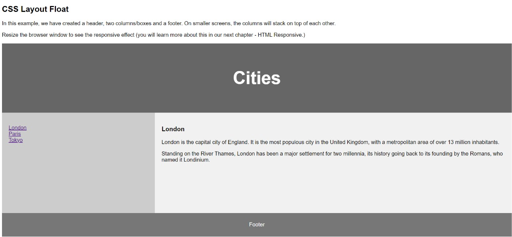

# NPNG-Full-Stack-Developer-Tasks
This repo contains tasks and solution when trained in NPNG Tech

# Training Session

## Sep-2:

### What happend?
Had basic introduction, got task to create Login Page and we shared the code for review. Mostly TeamLead is checking the code to understand the knowledge we have on Full Stack development

### Task: 
Build a SignUp and Login Page. On submitting the Submit button it should navigate to LoginPage without using JavaScript. i.e only HTML and CSS to be used

Task URL: [SignUpPage](./LoginPage/signup.html)

## Sep-3:
### What happend?
- First, check on yesterdays assignment
- New Tasks(CSS-Layout) is given and asked to complete

### Task:
Build a CSS Layout as given design reference

To create

Task URL: [CSS-Layout](./css-layout/index.html)